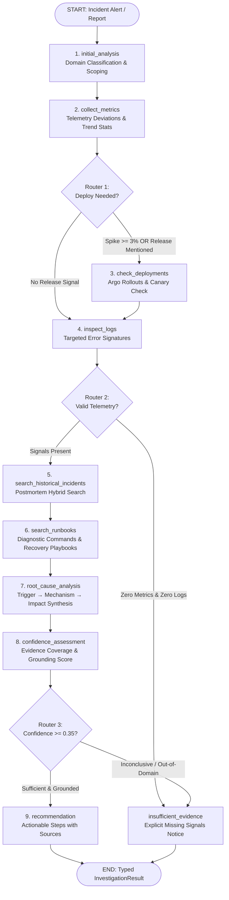

# OpsPilot AI — LangGraph Incident Investigation Agent Architecture

## 1. Executive Summary & Design Principles

Modern cloud incidents are rarely monolithic; they emerge from non-linear interactions across microservices, database connection pools, memory pressure, upstream partner latency, and recent deployment releases. 

When diagnosing an outage, human SREs do not execute an unguided stream of consciousness, nor do they blindly invoke every single observability CLI tool at once. Instead, experienced SREs formulate initial hypotheses based on symptoms, inspect targeted telemetry, correlate metrics with releases, query past postmortems, extract verified runbook remediation steps, assess confidence, and only recommend changes when supported by unambiguous evidence.

OpsPilot AI implements this diagnostic discipline using **LangGraph** (`app.agent.graph`).



---

## 2. Why LangGraph Instead of a Simple Sequential Chain

A simple sequential pipeline (e.g. LangChain `SequentialChain` or linear script `A -> B -> C -> D`) suffers from critical architectural failures in production SRE environments:

| Limitation of Simple Sequential Chains | LangGraph Solution in OpsPilot AI |
| :--- | :--- |
| **Blind Tool Execution**: A linear chain calls all tools on every incident regardless of symptoms, wasting API calls, burning database IOPS, and polluting the LLM context. | **Conditional Routing Edges**: Chained decisions (`route_after_metrics`, `route_after_logs`, `route_after_confidence`) branch dynamically based on runtime evidence. |
| **State Rigidity**: Linear pipelines pass a single string or dictionary forward; intermediate diagnostic states and timelines cannot be tracked or audited. | **Typed Global Graph State**: `InvestigationState` maintains persistent, append-only timelines, evidence items, and source attributions. |
| **No Early Stopping or Guardrails**: A sequential script runs to completion even when out-of-domain or ungrounded queries are introduced. | **Deterministic Guardrail Halting**: If metrics and logs are empty or queries are ungrounded, the graph short-circuits directly to `insufficient_evidence`. |
| **Cyclic & Multi-Path Reasoning**: Linear chains cannot branch into specialized diagnostic sub-graphs (e.g., database lock investigation vs. canary rollback). | **Directed Graph Topology**: State transitions easily support parallel fans, conditional branches, and looping validation checks. |

---

## 3. Graph State Definition

The execution state is governed by `InvestigationState` (`app.agent.state.InvestigationState`):

```python
class InvestigationState(TypedDict, total=False):
    # Incident Context
    incident_id: str
    service: str
    title: str
    description: str
    severity: str
    time_range: str

    # Diagnostic Hypotheses & Domain Classification
    suspected_domain: str        # database, deployment, jvm_memory, messaging, general
    has_database_symptoms: bool
    has_recent_deployments: bool
    check_deployment_needed: bool

    # Observability Evidence
    metrics_data: Optional[Dict[str, float]]
    metric_anomalies: List[str]
    logs_data: List[Dict[str, Any]]
    log_signatures: List[str]
    deployments: List[Dict[str, Any]]
    deployment_correlated: bool

    # Grounded Knowledge Artifacts
    historical_incidents: List[Dict[str, Any]]
    runbooks: List[Dict[str, Any]]

    # Diagnostic Synthesis & Evaluation
    suspected_root_cause: str
    confidence_score: float
    evidence: List[Dict[str, Any]]
    recommended_remediation: List[Dict[str, Any]]
    sources: List[Dict[str, Any]]

    # Guardrails & Rejection Handling
    has_sufficient_evidence: bool
    insufficient_evidence_reason: Optional[str]

    # Execution Observability & Timeline
    investigation_timeline: List[str]
    final_report: Optional[Dict[str, Any]]
```

---

## 4. Execution Nodes

All nodes (`app.agent.nodes`) are pure functions accepting the current state and returning a dictionary of state mutations:

### Node 1: `initial_analysis`
- **Purpose**: Parses the alert context, extracts keywords (e.g. `postgres`, `pool`, `hikari`, `jvm`, `kafka`, `deploy`), classifies the primary domain hypothesis, and initializes evidentiary lists.
- **Output Mutations**: `suspected_domain`, `has_database_symptoms`, `check_deployment_needed`, `evidence`, `sources`, `investigation_timeline`.

### Node 2: `collect_metrics`
- **Purpose**: Invokes `get_metrics(service, time_range)`. Computes baseline deviations on CPU, memory, error rates, p95 latency, and active connections. Employs `calculate_statistics` for statistical anomaly detection.
- **Output Mutations**: `metrics_data`, `metric_anomalies`, `check_deployment_needed` (set to `True` if error rate $\ge 3\%$ or CPU $\ge 90\%$), `has_database_symptoms` (set to `True` if active connections $\ge 150$).

### Node 3: `check_deployments` (Conditional)
- **Purpose**: Invokes `get_recent_deployments(service)`. Inspects recent Argo Rollout canary progression and rollout statuses (`SUCCESS`, `FAILED`, `ROLLED_BACK`).
- **Output Mutations**: `deployments`, `deployment_correlated`, attaches deployment evidence.

### Node 4: `inspect_logs`
- **Purpose**: Formulates targeted log queries based on the established domain (e.g. database pool queries `"pool OR connection OR timeout OR deadlock OR Hikari"`, JVM queries `"OutOfMemoryError OR GC OR heap"`). Invokes `search_logs(service, query, time_range)`.
- **Output Mutations**: `logs_data`, `log_signatures`, attaches log evidence.

### Node 5: `search_historical_incidents`
- **Purpose**: Uses synthesized log signatures and symptoms to query historical postmortems via Phase 5 hybrid retrieval.
- **Output Mutations**: `historical_incidents`, attaches historical incident evidence.

### Node 6: `search_runbooks`
- **Purpose**: Searches canonical operational runbooks for procedural troubleshooting guides. Extracts exact diagnostic SQL/shell commands and recovery playbooks.
- **Output Mutations**: `runbooks`, attaches runbook evidence.

### Node 7: `root_cause_analysis`
- **Purpose**: Synthesizes the causal chain across the collected evidence:
  $$\text{Trigger Event} \longrightarrow \text{Failure Mechanism} \longrightarrow \text{User / SRE Impact}$$
- **Output Mutations**: `suspected_root_cause`.

### Node 8: `confidence_assessment`
- **Purpose**: Evaluates evidence coverage quantitatively:
  $$\text{Confidence} = 0.25 \cdot \mathbf{1}_{\text{metrics}} + 0.30 \cdot \mathbf{1}_{\text{logs}} + 0.25 \cdot \mathbf{1}_{\text{historical}} + 0.20 \cdot \mathbf{1}_{\text{runbooks}}$$
  Flags `has_sufficient_evidence = False` if confidence $< 0.35$ or if query contains unsupported out-of-domain terms.
- **Output Mutations**: `confidence_score`, `has_sufficient_evidence`, `insufficient_evidence_reason`.

### Node 9: `recommendation` (Success Branch)
- **Purpose**: Formulates prioritized remediation steps, inserting emergency canary rollbacks at Step 1 if deployment correlation was discovered.
- **Output Mutations**: `recommended_remediation`, completed `investigation_timeline`.

### Node 10: `insufficient_evidence` (Fallback Branch)
- **Purpose**: Safely halts investigation when telemetry or runbook evidence is lacking, outputting a transparent missing signals disclosure.
- **Output Mutations**: `has_sufficient_evidence = False`, safe diagnostic command suggestions.

---

## 5. Conditional Routing Logic

The graph enforces three explicit conditional decision points (`app.agent.routing`):

### Router 1: `route_after_metrics`
```python
def route_after_metrics(state: InvestigationState) -> Literal["check_deployments", "inspect_logs"]:
    check_deploy = state.get("check_deployment_needed", False)
    title_lower = state.get("title", "").lower()
    desc_lower = state.get("description", "").lower()

    if check_deploy or "deploy" in title_lower or "release" in title_lower or "deploy" in desc_lower:
        return "check_deployments"
    return "inspect_logs"
```
*Design Rationale*: If a service's error rate spiked right after a release, checking deployments is mandatory. If the issue is a slow steady memory leak over 24 hours, querying deployment records is wasteful.

### Router 2: `route_after_logs`
```python
def route_after_logs(state: InvestigationState) -> Literal["search_historical_incidents", "insufficient_evidence"]:
    metric_anomalies = state.get("metric_anomalies", [])
    logs = state.get("logs_data", [])

    if not metric_anomalies and not logs:
        return "insufficient_evidence"
    return "search_historical_incidents"
```
*Design Rationale*: If neither metric deviations nor error logs were discovered, the agent immediately halts rather than inventing fictional incident matches.

### Router 3: `route_after_confidence`
```python
def route_after_confidence(state: InvestigationState) -> Literal["recommendation", "insufficient_evidence"]:
    has_evidence = state.get("has_sufficient_evidence", True)
    confidence = state.get("confidence_score", 0.0)

    if has_evidence and confidence >= 0.35:
        return "recommendation"
    return "insufficient_evidence"
```
*Design Rationale*: Ensures that no recommendations are returned unless grounded in factual evidence.

---

## 6. Safe Read-Only Investigation Tools

All tools adhere to strict read-only execution boundaries:

| Tool Name | Parameters | Safety Boundaries & Controls |
| :--- | :--- | :--- |
| `get_metrics` | `service: str`, `time_range: str = '1h'` | Strictly read-only; service name validated; time range capped at 7 days. |
| `search_logs` | `service: str`, `query: str = ''`, `time_range: str = '1h'`, `limit: int = 20` | Strictly read-only; output capped at 50 records to prevent memory bloat; sanitized query strings. |
| `search_historical_incidents` | `query: str`, `limit: int = 3` | Strictly read-only; hybrid semantic vector search; top-K capped at 10. |
| `search_runbooks` | `query: str`, `service: Optional[str]`, `limit: int = 3` | Strictly read-only; hybrid search with contextual reranking; top-K capped at 10. |
| `get_recent_deployments` | `service: str`, `limit: int = 5` | Strictly read-only; limited to recent releases (last 24-48h). |
| `calculate_statistics` | `data: List[float]`, `metric_name: str` | Pure mathematical calculation; input size capped at 10,000 points. |

---

## 7. Structured Typed Output

The agent outputs a validated Pydantic model (`InvestigationResult` in `app.schemas.agent`):

```json
{
  "incident_id": "INC-20260924061042",
  "service": "order-service",
  "incident_summary": "Investigation for 'PostgreSQL connection pool exhausted on order-service' affecting service 'order-service' (P1). Domain identified: database. 8 evidentiary artifacts collected across metrics, logs, deployments, and runbooks.",
  "suspected_root_cause": "A recent canary release to 'order-service' introduced heightened error rates. The 'order-service' connection pool reached saturation ceiling (active_connections >= 180/200), causing incoming HTTP worker threads to time out waiting for available database connections. Matches symptoms observed in past incident INC-2026-03-14.",
  "confidence": 1.0,
  "has_sufficient_evidence": true,
  "insufficient_evidence_reason": null,
  "evidence": [
    {
      "category": "metric",
      "source": "get_metrics",
      "description": "Connection pool saturation: 192 conns (baseline: 25 conns, +668.0%)",
      "severity_contribution": "critical"
    }
  ],
  "relevant_historical_incidents": [
    {
      "incident_id": "INC-2026-03-14",
      "title": "Incident Postmortem: INC-2026-03-14 Payment Gateway Cascading Timeout Outage",
      "severity": "P1",
      "similarity_score": 0.92
    }
  ],
  "recommended_remediation": [
    {
      "step_number": 1,
      "action": "Rollback order-service to previous stable revision",
      "command_or_config": "kubectl argo rollouts undo order-service -n production",
      "risk_level": "medium",
      "source_reference": "Deployment Standard: Kubernetes Argo Rollouts Canary and Automated Rollbacks"
    },
    {
      "step_number": 2,
      "action": "Execute diagnostic query on order-service",
      "command_or_config": "SELECT pid, state, now() - state_change AS duration, query FROM pg_stat_activity WHERE state = 'idle in transaction';",
      "risk_level": "low",
      "source_reference": "Runbook: PostgreSQL Connection Pool Exhaustion (ERR_POOL_EXHAUSTED)"
    }
  ],
  "sources": [
    {
      "title": "Runbook: PostgreSQL Connection Pool Exhaustion (ERR_POOL_EXHAUSTED)",
      "source_type": "operational_runbook",
      "reference_id": "doc_rb_pg_pool_exhaustion",
      "section": "Action 1: Terminate Leaked Idle Sessions"
    }
  ],
  "investigation_timeline": [
    "[11:40:42] Initial analysis completed. Suspected failure domain: 'database'.",
    "[11:40:42] Metrics collected: 3 anomalies detected. Pool/Latency flag=True, DeployCheck flag=True.",
    "[11:40:42] Deployment check completed. Correlated with recent rollout: True.",
    "[11:40:42] Log inspection completed: 5 records evaluated, 2 error signatures extracted.",
    "[11:40:42] Historical incident search: 1 matching postmortems retrieved.",
    "[11:40:42] Runbook retrieval completed: 1 playbooks located.",
    "[11:40:42] Root cause synthesis formulated.",
    "[11:40:42] Confidence assessment: score=1.00, sufficient_evidence=True.",
    "[11:40:42] Investigation completed with 6 remediation steps."
  ],
  "completed_at": "2026-09-24T11:40:42.500000Z"
}
```

---

## 8. Safety Boundaries & Guardrails Summary

1. **No Autonomous State Mutation**: The agent cannot execute destructive writes, update Kubernetes deployments directly, or alter database rows. All suggested CLI commands are delivered as structured guidance for human SRE review.
2. **Deterministic Anti-Hallucination**: Insufficient evidence triggers an explicit rejection state rather than speculative diagnosis.
3. **Execution Time Boundedness**: Tool limits (max 50 logs, max 10 runbooks, max 7-day windows) guarantee predictable sub-second response times.
