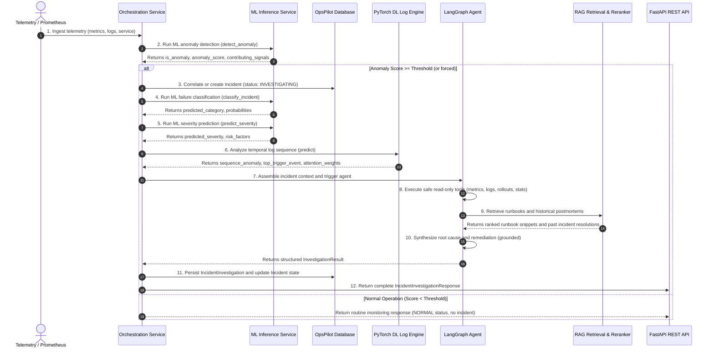

# OpsPilot AI — End-to-End Intelligent Incident Orchestration Pipeline

OpsPilot AI **Phase 7: Intelligent Incident Orchestration** integrates the machine learning, deep learning, RAG, and agent layers into a unified, robust, and autonomous SRE investigation pipeline.

This document describes the complete flow from observability metric ingestion to final grounded remediation, details the separation of responsibilities, and explains how each failure case degrades gracefully.

---

## 1. System Architecture & Component Separation

A foundational principle of OpsPilot AI is the **strict separation of responsibilities**:

```
┌────────────────────────────────────────────────────────────────────────────────────────┐
│                                 OBSERVABILITY STREAM                                   │
│                     (Metrics, Log Messages, Service Topology)                          │
└───────────────────────────────────────────┬────────────────────────────────────────────┘
                                            │
                                            ▼
┌────────────────────────────────────────────────────────────────────────────────────────┐
│ 1. DETECTION (Deterministic ML)                                                       │
│    Model: Isolation Forest / Rolling Statistics Pipeline                              │
│    Output: is_anomaly (bool), anomaly_score [0.0 - 1.0], contributing_signals          │
└───────────────────────────────────────────┬────────────────────────────────────────────┘
                                            │
                                            ▼
┌────────────────────────────────────────────────────────────────────────────────────────┐
│ 2. CLASSIFICATION & SEVERITY (Deterministic ML)                                        │
│    Models: XGBoost Multi-Class Classifier & XGBoost Severity Predictor                 │
│    Output: failure_category (database, application, etc.), severity (P1-P4), risk_factors │
└───────────────────────────────────────────┬────────────────────────────────────────────┘
                                            │
                                            ▼
┌────────────────────────────────────────────────────────────────────────────────────────┐
│ 3. SEQUENCE TRIGGER ATTRIBUTION (Deep Learning)                                        │
│    Model: PyTorch BiLSTM/GRU with Multi-Head Self-Attention                            │
│    Output: sequence_anomaly (bool), attention_weights, top_trigger_event (exact log line) │
└───────────────────────────────────────────┬────────────────────────────────────────────┘
                                            │
                                            ▼
┌────────────────────────────────────────────────────────────────────────────────────────┐
│ 4. INVESTIGATION (LangGraph Multi-Node Agent)                                          │
│    Topology: 10 diagnostic nodes with safe read-only tools and conditional routing      │
│    Output: Itemized telemetry deviations, canary status, error signatures, statistics  │
└───────────────────────────────────────────┬────────────────────────────────────────────┘
                                            │
                                            ▼
┌────────────────────────────────────────────────────────────────────────────────────────┐
│ 5. RETRIEVAL & GROUNDING (RAG Layer)                                                  │
│    Engine: pgvector Hybrid Retrieval (Dense Cosine + Sparse BM25) & Cross-Encoder     │
│    Output: Operational runbooks, diagnostic CLI commands, historical incident postmortems│
└───────────────────────────────────────────┬────────────────────────────────────────────┘
                                            │
                                            ▼
┌────────────────────────────────────────────────────────────────────────────────────────┐
│ 6. DIAGNOSIS & RECOMMENDATION (Synthesis Layer)                                        │
│    Engine: Grounded causal synthesis preserving deterministic ML/DL metrics            │
│    Output: suspected_root_cause, confidence, cited sources, recommended remediation   │
└────────────────────────────────────────────────────────────────────────────────────────┘
```

### Strict Non-Replacement Rule
> [!IMPORTANT]
> **Deterministic ML components are NEVER replaced or overridden by the LLM.**
> - Measurable predictions (anomaly score, failure category, severity rating, and log sequence trigger attribution) are produced by dedicated, validated statistical and deep learning models.
> - The LLM's role is strictly confined to **causal reasoning, contextual synthesis, and grounded remediation recommendation** based on the facts and evidence assembled by the ML, DL, and agent tools.

---

## 2. The 12-Step Incident Orchestration Pipeline



### Step-by-Step Execution Details

#### Step 1: Receive Observability Data
- Ingests standard telemetry metrics: CPU utilization, memory utilization, disk usage, network throughput, request count, p95 latency, error rate, and active socket connections.
- Accepts optional raw log lines and historical metric buffer for rolling statistics.
- Validates inputs using Pydantic schema `TelemetryIngestRequest`.

#### Step 2: Run ML Anomaly Detection
- Passes standardized metrics to `MLInferenceService.detect_anomaly()`.
- Uses an unsupervised Isolation Forest model (trained on baseline multi-dimensional telemetry) or rolling z-score dynamics.
- Produces a calibrated `anomaly_score` $[0.0 - 1.0]$, boolean flag `is_anomaly`, and itemized `contributing_signals`.

#### Step 3: Anomaly Threshold Evaluation & Incident Creation
- Compares `anomaly_score` against `anomaly_threshold` (default: `0.50`).
- If below threshold, records normal operational check without creating alert fatigue.
- If threshold is crossed:
  - Checks database for existing open incidents on the target service in `INVESTIGATING` or `IDENTIFIED` status to prevent duplicate tickets.
  - If no active incident exists, inserts a new `Incident` record with unique identifier (e.g. `INC-20260928-XXXX`).

#### Step 4: Run ML Incident Classification
- Passes incident context and metric vector to `MLInferenceService.classify_incident()`.
- Evaluates an XGBoost Multi-Class model trained across six canonical failure categories:
  - `database` (connection saturation, deadlocks, slow queries)
  - `application` (runtime exceptions, OOM, thread pool exhaustion)
  - `deployment` (canary regressions, bad config, image mismatch)
  - `network` (gateway timeouts, connection resets, DNS failures)
  - `infrastructure` (host saturation, disk fill, CPU throttling)
  - `external_dependency` (third-party payment/auth gateway failures)
- Returns `predicted_category` and probability distribution.

#### Step 5: Run ML Severity Prediction
- Passes incident telemetry to `MLInferenceService.predict_severity()`.
- An XGBoost Classifier predicts severity:
  - `P1_CRITICAL`: Widespread outage, customer-impacting degradation.
  - `P2_HIGH`: Elevated error rates, primary functionality degraded.
  - `P3_MEDIUM`: Moderate latency or single replica failure.
  - `P4_LOW`: Minor deviation or warning state.
- Returns `predicted_severity` and technical `risk_factors`.

#### Step 6: Deep Learning Log Sequence Analysis
- Queries the service's chronological log stream.
- Feeds sequence to `LogSequenceInferenceEngine` running a PyTorch BiLSTM/GRU neural network with self-attention.
- Evaluates template transitions and extracts:
  - `is_anomaly`: sequence-level anomaly classification.
  - `anomaly_probability`: calibrated softmax probability.
  - `top_trigger_event`: the specific log event receiving maximum self-attention, pinpointing the root trigger line.
  - `attention_weights`: attribution distribution across the window.

#### Step 7: Send Incident Context to LangGraph Agent
- Upstream deterministic outputs (`anomaly_score`, `predicted_category`, `predicted_severity`, `dl_log_analysis`) are packaged into `agent_context_overrides` and passed to the LangGraph state graph.

#### Step 8: Agent Investigates Using Read-Only Tools
- The LangGraph investigation graph executes across 10 diagnostic nodes.
- Calls specialized, safe read-only tools:
  - `get_metrics`: Verifies trend deviations and 2-sigma outliers.
  - `check_deployments`: Checks Argo Rollouts canary status if release signals are present.
  - `inspect_logs`: Runs ReDoS-safe regex searches for fatal stack traces.
  - `calculate_statistics`: Computes interquartile range (IQR) and p99 metrics.

#### Step 9: RAG Knowledge Retrieval & Reranking
- Queries the knowledge base using `HybridRetriever`:
  - Dense semantic retrieval via pgvector embeddings.
  - Sparse lexical matching via BM25 / ILIKE.
  - Contextual Cross-Encoder reranking prioritizing authoritative operational playbooks.
- Retrieves:
  - Matching runbook chapters with triage procedures.
  - Exact diagnostic shell and SQL commands.
  - Historical incident postmortems with validated resolution steps.

#### Step 10: Grounded Root-Cause Analysis
- Synthesizes findings into a coherent causal explanation:
  - Trigger $\rightarrow$ Mechanism $\rightarrow$ Impact.
  - Cites specific evidence items (metric spikes, log signatures, canary steps).
  - Assesses confidence score based on signal coverage $[0.0 - 1.0]$.
  - If confidence $< 0.35$ or out-of-domain terms are detected, halts safely with transparent `INSUFFICIENT_EVIDENCE` notice without guessing.

#### Step 11: Store Investigation Result & Update Incident State
- Creates an `IncidentInvestigation` domain record in the database:
  - Stores all deterministic ML/DL metrics, evidence list, timeline, and cited sources.
- Updates the parent `Incident` record:
  - `severity = predicted_severity`
  - `incident_type = predicted_category`
  - `root_cause = suspected_root_cause`
  - `resolution = recommended remediation steps`
  - `status = "IDENTIFIED"` (or `"INVESTIGATING"`)

#### Step 12: Expose Complete State Through API
- Returns the complete `IncidentInvestigationResponse` via REST endpoint.

---

## 3. Incident Investigation Domain Model

The domain model is implemented in SQLAlchemy ORM ([`IncidentInvestigation`](../backend/app/models/investigation.py)) and Pydantic ([`IncidentInvestigationResponse`](../backend/app/schemas/orchestration.py)):

| Field Name | Type | Description | Layer Owner |
| :--- | :--- | :--- | :--- |
| `incident_id` | `str` | Unique incident identifier (e.g. `INC-2026-001`) | Platform Core |
| `investigation_id` | `str` | Unique investigation run ID (e.g. `INV-20260928-123456`) | Orchestrator |
| `service_id` | `str` | Identifier of affected microservice | Observability |
| `status` | `str` | `COMPLETED`, `INSUFFICIENT_EVIDENCE`, `DEGRADED`, `NORMAL` | Orchestrator |
| `detected_anomaly` | `bool` | Deterministic anomaly flag | ML Detection |
| `anomaly_score` | `float` | Continuous anomaly score $[0.0 - 1.0]$ | ML Detection |
| `predicted_category` | `str` | Failure domain (`database`, `application`, etc.) | ML Classifier |
| `predicted_severity` | `str` | Severity rating (`P1_CRITICAL` to `P4_LOW`) | ML Severity |
| `dl_log_analysis` | `dict` | Sequence probability, top trigger event, attention weights | DL PyTorch |
| `suspected_root_cause` | `str` | Synthesized causal mechanism | Agent Diagnosis |
| `confidence` | `float` | Grounding and evidence coverage score $[0.0 - 1.0]$ | Agent Guardrails |
| `evidence` | `list` | Itemized artifacts (metrics, logs, rollouts, runbooks) | Agent Diagnostic Tools |
| `similar_incidents` | `list` | Top matching past postmortems with resolution summaries | RAG Historical Search |
| `retrieved_sources` | `list` | Cited runbooks, architecture docs, and guide sections | RAG Knowledge Base |
| `recommended_remediation`| `list` | Actionable commands and procedures with risk levels | RAG Playbooks |
| `timeline` | `list` | Chronological execution trace across all 12 steps | Observability Trace |
| `degraded_components` | `list` | List of components running in fallback mode | Fault Tolerance |

---

## 4. Failure Modes & Graceful Degradation

OpsPilot AI is engineered to operate reliably in degraded, offline, or partial failure conditions. Under no circumstance should a failure in an auxiliary AI service crash the core pipeline:

### 1. ML Model Unavailable
- **Failure Condition**: Model files missing from disk, MLflow registry unreachable, or model deserialization error.
- **Graceful Behavior**:
  - The pipeline catches `RuntimeError` / `Exception` during detection, classification, or severity prediction.
  - Automatically switches to **Deterministic Statistical Heuristics**:
    - Anomaly detection checks multi-sigma deviations and saturation limits (`cpu > 85%`, `error_rate > 5%`, `latency > 1000ms`, `connections > 80`).
    - Classification inspects keyword tokens in symptoms and metrics.
    - Severity uses standard SRE tier thresholds.
  - Adds `"ml_anomaly_fallback"`, `"ml_classification_fallback"`, or `"ml_severity_fallback"` to `degraded_components`.
  - The pipeline proceeds to downstream stages without interruption.

### 2. Embedding Service Unavailable
- **Failure Condition**: Embedding model cannot be loaded, CUDA out of memory, or external embedding API unreachable.
- **Graceful Behavior**:
  - Semantic vector search falls back to **Lexical BM25 & ILIKE Database Search**.
  - Matches keywords and exact error codes against runbook titles and incident postmortem records.
  - Adds `"embeddings_fallback"` to `degraded_components`.

### 3. Vector Database Unavailable
- **Failure Condition**: `pgvector` extension missing, database connection pool exhausted, or database server unreachable.
- **Graceful Behavior**:
  - RAG tools fall back to the **In-Memory Curated Knowledge Base** containing core playbooks and recovery commands.
  - Standard relational queries are bypassed or run against cached mirrors.
  - Adds `"vector_db_fallback"` to `degraded_components`.

### 4. Deep Learning Sequence Engine Unavailable
- **Failure Condition**: PyTorch weights corrupt or GPU/CPU memory exhausted.
- **Graceful Behavior**:
  - Falls back to the **Regex Error Signature Miner**, scanning raw logs for `FATAL`, `ERROR`, `Exception`, and `Timeout` lines.
  - The highest severity log event is assigned attention weight `1.0` as the top trigger event.
  - Adds `"dl_log_model_fallback"` to `degraded_components`.

### 5. Agent Tool Failure
- **Failure Condition**: Prometheus API down, Argo Rollouts inaccessible, or Kubernetes API timeout during tool execution.
- **Graceful Behavior**:
  - Each individual tool invocation in the LangGraph graph is guarded by try/except.
  - If a tool fails, it logs a warning, appends a degraded finding to `evidence`, records the error in `timeline`, and returns a safe fallback output.
  - Sibling tools and downstream synthesis continue executing normally.

### 6. Insufficient Evidence
- **Failure Condition**: Telemetry deviations are missing, logs contain zero errors, or the alert describes an unsupported/out-of-domain technology (e.g. quantum teleportation).
- **Graceful Behavior**:
  - The confidence assessment node calculates a score $< 0.35$.
  - Conditional router branches to `insufficient_evidence_node`.
  - The agent **refuses to hallucinate** a root cause.
  - Sets `status = "INSUFFICIENT_EVIDENCE"` and itemizes exactly which telemetry signals are absent.
  - Recommends safe non-destructive observation actions (e.g., `kubectl logs -f deployment/<service> --tail=200`).

---

## 5. REST API Usage Examples

### 1. Ingest Telemetry & Execute Orchestration
```bash
curl -X POST http://localhost:8000/api/v1/orchestration/process-telemetry \
  -H "Content-Type: application/json" \
  -d '{
    "service_id": "order-api",
    "cpu_usage": 88.5,
    "memory_usage": 86.2,
    "latency_p95_ms": 3250.0,
    "error_rate": 0.185,
    "active_connections": 185,
    "recent_logs": [
      "WARN [order-api] HikariPool-1 - Connection pool approaching maximum size: active=170, max=200",
      "ERROR [order-api] ConnectionTimeoutException: Connection is not available, request timed out after 30000ms",
      "FATAL [order-api] HikariPool-1 - Connection is not available, pool exhausted."
    ],
    "title": "HikariCP pool saturation on order-api",
    "description": "API latency surged to 3250ms with 18.5% error rate."
  }'
```

### 2. Inspect Pipeline Health & Component Readiness
```bash
curl -X GET http://localhost:8000/api/v1/orchestration/pipeline/status
```

Response:
```json
{
  "pipeline_status": "HEALTHY",
  "components": {
    "ml_anomaly": {
      "name": "ML Anomaly",
      "status": "READY",
      "version": "v1.0.0",
      "details": "Algorithm: isolation_forest"
    },
    "ml_classification": {
      "name": "ML Classification",
      "status": "READY",
      "version": "v1.0.0",
      "details": "Algorithm: xgboost"
    },
    "ml_severity": {
      "name": "ML Severity",
      "status": "READY",
      "version": "v1.0.0",
      "details": "Algorithm: xgboost"
    },
    "deep_learning_log_analysis": {
      "name": "PyTorch Log Sequence Model",
      "status": "READY",
      "version": "champion_v1",
      "details": "Device: cpu, Vocab size: 31"
    },
    "langgraph_investigation_agent": {
      "name": "LangGraph Diagnostic Agent",
      "status": "READY",
      "version": "v2.0",
      "details": "10 safe diagnostic nodes, 6 read-only tools, conditional routing"
    },
    "rag_knowledge_system": {
      "name": "RAG Hybrid Retrieval & Reranker",
      "status": "READY",
      "version": "v1.0",
      "details": "pgvector hybrid search + cross-encoder contextual reranker"
    }
  },
  "timestamp": "2026-09-28T09:30:00Z"
}
```

### 3. Retrieve Stored Investigation by Incident ID
```bash
curl -X GET http://localhost:8000/api/v1/orchestration/investigations/INC-20260928123456
```
