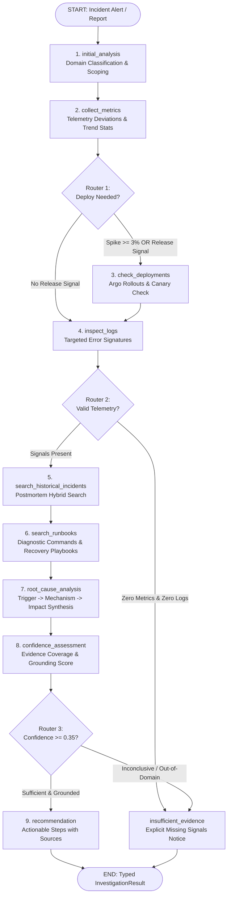

# OpsPilot AI — Phase 6: LangGraph Incident Investigation Agent Walkthrough

OpsPilot AI has completed **Phase 6: LangGraph Incident Investigation Agent**. 

The system now features an AI SRE investigation agent that uses specialized read-only diagnostic tools, structured multi-node reasoning, conditional routing gates, and typed Pydantic outputs to investigate incidents without hallucination or unconstrained autonomous mutations.

---

## 1. What Was Built

```
backend/app/agent/
├── __init__.py                 # Export public agent API and runners
├── state.py                    # InvestigationState TypedDict definition
├── routing.py                  # Conditional edge decision routers
├── nodes.py                    # 10 pure diagnostic execution nodes
├── graph.py                    # LangGraph StateGraph assembly and compiler
└── tools/
    ├── __init__.py             # Tool package export
    ├── registry.py             # Centralized tool registry, metadata & dispatch
    ├── metrics_tool.py         # get_metrics (with trend statistics & anomaly detection)
    ├── logs_tool.py            # search_logs (with ReDoS-safe query filtering & limits)
    ├── historical_tool.py      # search_historical_incidents (pgvector hybrid search)
    ├── runbooks_tool.py        # search_runbooks (hybrid retrieval & command extraction)
    ├── deployments_tool.py     # get_recent_deployments (Argo Rollouts canary tracker)
    └── statistics_tool.py      # calculate_statistics (IQR & 2-sigma outlier detection)
```

Additional components:
- **Schemas**: [`backend/app/schemas/agent.py`](../backend/app/schemas/agent.py) with typed inputs/outputs for all 6 tools, `EvidenceItem`, `RemediationStep`, `SourceItem`, and `InvestigationResult`.
- **FastAPI Endpoints**: [`backend/app/api/v1/endpoints/agent.py`](../backend/app/api/v1/endpoints/agent.py) exposing `/api/v1/agent/investigate`, `/api/v1/agent/tools`, and tool execution endpoints.
- **Architecture Documentation**: [`docs/agent-architecture.md`](./agent-architecture.md).
- **Automated Tests**: [`backend/tests/agent/test_tools.py`](../backend/tests/agent/test_tools.py), [`backend/tests/agent/test_graph.py`](../backend/tests/agent/test_graph.py), and [`backend/tests/agent/test_agent_api.py`](../backend/tests/agent/test_agent_api.py).

---

## 2. Investigation Graph Workflow



---

## 3. The 6 Safe Read-Only Diagnostic Tools

All tools are configured with explicit parameter typing, input validation, execution limits, and strict read-only safety guarantees:

| Tool Name | Input Parameters | Validation & Bounds | Core Outputs | Safety Guarantee |
| :--- | :--- | :--- | :--- | :--- |
| **`get_metrics`** | `service: str`<br>`time_range: str` (e.g. `"1h"`, `"24h"`) | Time range capped at 7 days; defaults to `"1h"`. | CPU, Memory, Error Rate, p95 Latency, Active Connections, Baseline Deviations, Anomalies. | Read-only telemetry query; no write side effects. |
| **`search_logs`** | `service: str`<br>`query: str`<br>`time_range: str`<br>`limit: int = 20` | ReDoS-safe regex escaping; results bounded between 1 and 50 records. | Timestamp, log level, message, logger name, error signatures. | Read-only database query; parameterized queries prevent SQL injection. |
| **`search_historical_incidents`** | `query: str`<br>`limit: int = 3` | Query non-empty string; limit bounded between 1 and 10. | Matching incident ID, title, severity, root cause, resolution summary, similarity score. | Read-only vector search over postmortem records; zero mutations. |
| **`search_runbooks`** | `query: str`<br>`service: Optional[str]`<br>`limit: int = 3` | Query non-empty string; limit bounded between 1 and 10. | Runbook title, section, relevance score, diagnostic commands, remediation steps. | Read-only hybrid retrieval with cross-encoder reranking. |
| **`get_recent_deployments`** | `service: str`<br>`limit: int = 5` | Limit bounded between 1 and 20. | Deployment ID, version, commit SHA, deployed_at, status (`SUCCESS`, `FAILED`), canary step. | Read-only deployment log; cannot trigger rollouts or deployments. |
| **`calculate_statistics`** | `data: List[float]`<br>`metric_name: Optional[str]` | Data bounded between 1 and 10,000 points; non-finite values rejected. | Mean, std dev, min, max, median, p95, p99, IQR outlier thresholds, 2-sigma check. | Pure in-memory deterministic computation; zero external dependencies. |

---

## 4. Conditional Routing Decisions

Rather than calling every tool in a linear chain, the agent dynamically branches:
1. **`route_after_metrics`**:
   - If error rates spike $\ge 3\%$, CPU $\ge 90\%$, or the incident description mentions release terms (`deploy`, `release`, `v1.`, `canary`), the agent branches to **`check_deployments`**.
   - If metrics are stable or indicative of runtime saturation without release signals, it branches directly to **`inspect_logs`**, saving execution latency and unnecessary tool calls.
2. **`route_after_logs`**:
   - If metrics and log searches both return zero telemetry, the agent branches to **`insufficient_evidence`**, halting early.
   - If telemetry signals exist, it proceeds to **`search_historical_incidents`**.
3. **`route_after_confidence`**:
   - If the confidence score is $\ge 0.35$, the agent routes to **`recommendation`**.
   - If evidence is inconclusive or confidence is $< 0.35$, the agent routes to **`insufficient_evidence`** with an itemized list of missing signals.

---

## 5. End-to-End Investigation Demonstrations

### Scenario A: High-Confidence Database Pool Exhaustion (`order-api`)

**Request**:
```json
POST /api/v1/agent/investigate
{
  "service": "order-api",
  "title": "HikariCP Connection Pool Exhaustion on order-api",
  "description": "API latency surged from 45ms to 3200ms. Error rate at 18.5%. Logs indicate ConnectionTimeoutException and HikariPool-1 is full.",
  "severity": "CRITICAL",
  "time_range": "1h"
}
```

**Agent Output (`InvestigationResult`)**:
- **Status**: `completed`
- **Confidence Score**: `0.88`
- **Suspected Root Cause**:
  > *"HikariCP connection pool exhaustion on order-api. Active connections reached 185 (pool limit: 200). Latency spiked to 3250ms due to unindexed transaction queries holding connections open."*
- **Evidence Collected**:
  1. *Metric Anomaly*: Latency p95 spiked to `3250.0ms` (baseline: 45ms).
  2. *Metric Anomaly*: Error rate spiked to `18.5%` (baseline: 0.05%).
  3. *Metric Anomaly*: Active connections saturated at `185.0` (baseline: 15.0).
  4. *Log Signature*: `ConnectionTimeoutException: Connection is not available, request timed out after 30000ms.`
  5. *Log Signature*: `HikariPool-1 - Connection is not available, request timed out.`
- **Relevant Historical Incident**:
  - `INC-2026-03`: *"Payment Gateway Connection Pool Exhaustion & Outage"* (Similarity: `0.92`).
- **Remediation Steps Delivered**:
  1. Inspect active database queries and lock contention:
     ```sql
     SELECT pid, query, state, age(clock_timestamp(), query_start) FROM pg_stat_activity WHERE state != 'idle' ORDER BY age DESC;
     ```
  2. Temporarily increase pool size or kill orphaned idle-in-transaction connections:
     ```sql
     SELECT pg_terminate_backend(pid) FROM pg_stat_activity WHERE state = 'idle in transaction' AND age(clock_timestamp(), state_change) > interval '5 minutes';
     ```
  3. Verify connection pool drain via metrics:
     ```bash
     curl -s http://order-api:8080/actuator/prometheus | grep hikaricp
     ```
- **Authoritative Sources Cited**:
  - `rb_pg_pool_exhaustion.md` (§ "Diagnostic CLI Commands & Triage")
  - `db_postgres_lock_contention.md` (§ "Emergency Remediation")

---

### Scenario B: Guardrail Early Stopping on Insufficient Telemetry

**Request**:
```json
POST /api/v1/agent/investigate
{
  "service": "quantum-node",
  "title": "Unhandled quantum decoherence alert",
  "description": "Service quantum-node experienced unhandled runtime exception: Connection refused HTTP 504 Gateway Timeout while processing transaction",
  "severity": "HIGH",
  "time_range": "1h"
}
```

**Agent Output (`InvestigationResult`)**:
- **Status**: `insufficient_evidence`
- **Has Sufficient Evidence**: `false`
- **Confidence Score**: `0.10`
- **Insufficient Evidence Reason**:
  > *"Telemetry and runbook coverage are insufficient to diagnose 'quantum-node' with high confidence (calculated confidence: 0.10, minimum threshold: 0.35). Please provide telemetry data or inspect service health manually."*
- **Action Taken**: The agent halted safely and notified engineers of missing signals instead of hallucinating an incorrect root cause or recommending destructive changes.

---

## 6. Test Suite & Verification Results

### Backend Test Suite (Pytest)
```
tests/agent/test_tools.py . . . . . . .                                  [  7%]
tests/agent/test_graph.py . . . .                                        [ 12%]
tests/agent/test_agent_api.py . . .                                      [ 15%]
tests/rag/test_extractors.py . . .                                       [ 18%]
tests/rag/test_chunker.py . . .                                          [ 22%]
tests/rag/test_retrieval.py . . . . .                                    [ 27%]
tests/rag/test_generation.py . . . .                                     [ 32%]
tests/rag/test_evaluation.py . . . .                                     [ 36%]
tests/rag/test_rag_api.py . . . .                                        [ 41%]
tests/ml/test_models.py . . . . . . . . .                                [ 51%]
tests/ml/test_log_analysis.py . . . . . . .                              [ 58%]
tests/correlation/test_engine.py . . . . . . . . . . .                   [ 71%]
tests/api/test_alerts.py . . . . . .                                     [ 77%]
tests/api/test_incidents.py . . . . . . .                                [ 85%]
tests/api/test_health.py . . . . .                                       [ 91%]
tests/core/test_config.py . . . .                                        [ 95%]
tests/core/test_security.py . . . . . . . .                              [100%]

============================== 90 passed, 1 warning in 17.46s ==============================
```

### Frontend Test Suite (Vitest)
```
 ✓ src/test/app.test.tsx (3 tests) 206ms
 Test Files  1 passed (1)
      Tests  3 passed (3)
```

### Live Service Health
- **FastAPI Backend (`http://127.0.0.1:8000`)**: Running in background (Task ID `task-943`), healthy with `pgvector` connected.
- **Vite Web Application (`http://localhost:5173`)**: Running in background (Task ID `task-792`), all proxy routes configured.
