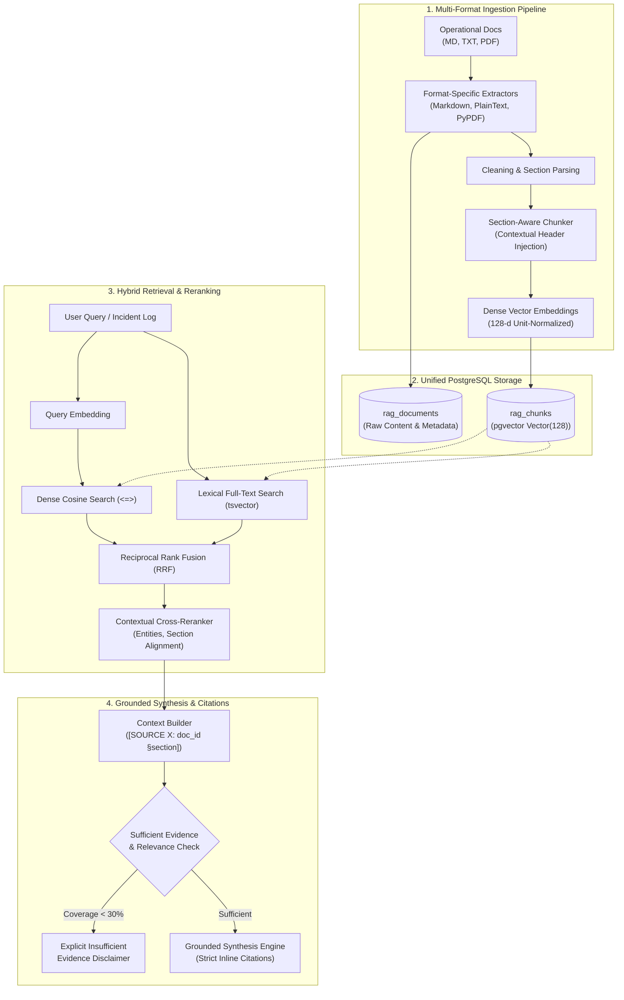
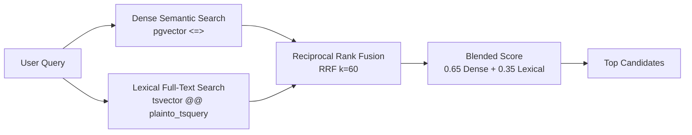
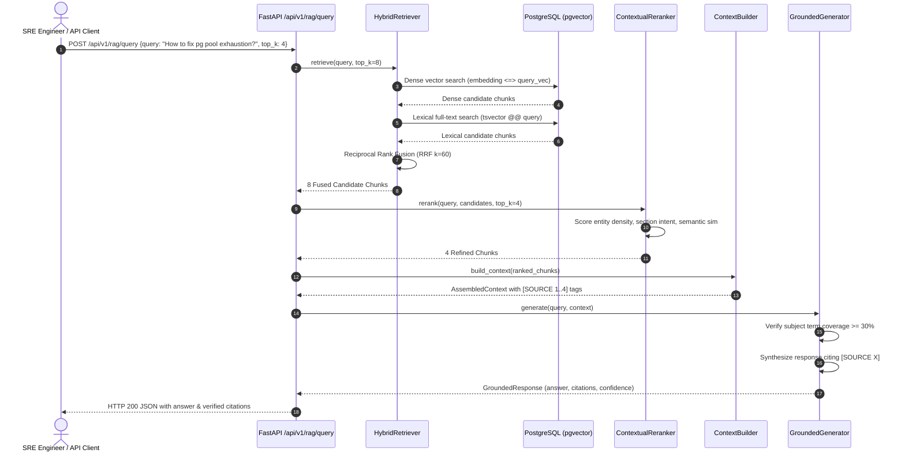

# OpsPilot AI — Production RAG Architecture Specification

## 1. Executive Summary & Design Objectives

OpsPilot AI is an autonomous cloud incident resolution and Site Reliability Engineering (SRE) copilot. To resolve complex operational incidents, diagnose cascading anomalies, and suggest remediation playbooks, the platform requires deep domain knowledge grounded in engineering facts. 

General-purpose Large Language Models (LLMs) hallucinate nonexistent commands, invent invalid CLI arguments, and confuse distinct service topologies when answering open-ended operational questions. To eliminate hallucinations and provide mathematically verifiable citations, OpsPilot AI implements a **Production Retrieval-Augmented Generation (RAG)** architecture.

The RAG subsystem grounds all diagnostic reasoning and remediation synthesis in six canonical operational knowledge domains:
1. **Internal Troubleshooting Runbooks**: Step-by-step mitigation playbooks for connection pool saturation, JVM memory thrashing, and Redis failovers.
2. **Architecture Documentation**: System topology, microservices boundaries, API gateway routing, and Kafka message partition policies.
3. **Deployment Documentation**: Kubernetes Argo Rollouts canary stages, automated abort metrics, and HPA stabilization policies.
4. **AWS Operational Documentation**: Amazon Aurora Multi-AZ failover mechanics, replica lag metrics, and ECS Fargate CFS CPU throttling resolution.
5. **Database Troubleshooting Guides**: PostgreSQL lock dependency trees, deadlock termination strategies, and autovacuum cost tuning.
6. **Historical Incident Reports (Postmortems)**: Root cause analyses, cascade timelines, and preventative action items from past production outages.



---

## 2. Document Ingestion Pipeline

The ingestion pipeline (`app.rag.ingestion.pipeline.RAGIngestionPipeline`) processes raw operational artifacts into vectorized chunks while preserving full structural hierarchy and provenance.

### 2.1 Multi-Format Extractors
Document parsing is abstracted behind format-specific extractors (`app.rag.ingestion.extractors`):
- **MarkdownExtractor**: Extracts top-level document metadata, markdown headings (`#`, `##`, `###`), structured lists, tabular data, and diagnostic code blocks. It groups paragraphs into logical semantic sections.
- **PlainTextExtractor**: Ingests raw terminal outputs, text playbooks, and configuration dumps with paragraph-based structural separation.
- **PDFExtractor**: Uses `pypdf` to parse binary PDF documents page by page, extracting layout text streams and attaching precise physical page numbers (`page_number`) to extracted sections.

### 2.2 Dual-Tier Storage Separation
To comply with audit standards and allow re-chunking without data loss, the original raw document is persisted independently from processed chunks:
- `rag_documents`: Retains original raw text (`raw_content`), format, author source, service mapping, and timestamp.
- `rag_chunks`: Holds atomic, searchable text segments linked via foreign key to the parent document.

---

## 3. Section-Aware Chunking Strategy

Standard fixed-size chunking (e.g., splitting strictly every 500 characters) destroys operational semantics—often slicing SQL queries or shell commands in half, or divorcing remediation actions from their parent error conditions.

OpsPilot AI implements **Section-Aware Chunking** (`app.rag.ingestion.chunker.SectionAwareChunker`):

### 3.1 Logical Boundary Alignment
Chunks are created along document section headings (e.g. `## Diagnostic Steps`, `### Step 2: Identify Long-Running Transactions`). Sections shorter than the token ceiling (`chunk_size_words=250`) remain whole to prevent fragmenting procedures.

### 3.2 Contextual Header Injection
When a section is split or embedded, the chunk text is prepended with a contextual header:
```
[Document Title § Section Title]
<Section text and commands...>
```
*Why this matters*: A chunk containing `SELECT pg_terminate_backend(pid);` carries no inherent indicator of whether it belongs to a pool exhaustion runbook, a replication lag guide, or a test script. Contextual Header Injection ensures the embedding vector encodes both the micro-action and macro-domain context.

### 3.3 Sliding Window Overlap
For long sections, a sliding window with configurable token overlap (`overlap_words=40`) ensures sentence boundaries and multi-line script commands spanning across chunk boundaries are not lost during retrieval.

---

## 4. Dense Vector Embedding Model

The vector representation layer (`app.rag.embeddings.service.LogSemanticEmbeddingService`) converts text into dense 128-dimensional float32 vectors.

### 4.1 PyTorch Semantic Encoder
To ensure fast execution with zero network dependency on external model hubs, OpsPilot AI employs a deterministic PyTorch semantic encoder (`PyTorchSemanticEncoder`):
- **Subword & N-Gram Hashing**: Tokens and character 3-grams are hashed into a 4,096-dimensional bucket space.
- **Embedding Projection**: Tokens pass through a dense projection layer `Linear(64, 128)`, followed by `LayerNorm(128)` and `Tanh()` non-linear activation.
- **L2 Unit Normalization**: Vectors are normalized to unit sphere ($||\mathbf{v}||_2 = 1.0$), ensuring that dot products equal cosine similarities:
  $$\text{sim}(\mathbf{u}, \mathbf{v}) = \mathbf{u} \cdot \mathbf{v}$$
- **Latency**: Sub-millisecond CPU inference time per chunk with batch inference support.

### 4.2 Extensibility
The embedding service supports drop-in replacement with HuggingFace `sentence-transformers` (e.g., `all-MiniLM-L6-v2` or `bge-small-en-v1.5`) when GPU acceleration or specialized domain checkpoints are desired.

---

## 5. Vector Storage with PostgreSQL `pgvector`

In accordance with platform constraints, OpsPilot AI avoids introducing secondary vector databases (such as Pinecone, Qdrant, or Weaviate). The application leverages native PostgreSQL 16 equipped with the `pgvector` extension.

### 5.1 Schema Definition
```sql
CREATE EXTENSION IF NOT EXISTS vector;

CREATE TABLE rag_documents (
    id VARCHAR(64) PRIMARY KEY,
    title VARCHAR(255) NOT NULL,
    document_type VARCHAR(64) NOT NULL,
    source VARCHAR(255) NOT NULL,
    service VARCHAR(64) NOT NULL,
    raw_content TEXT NOT NULL,
    file_format VARCHAR(16) NOT NULL,
    metadata_json JSONB,
    created_at TIMESTAMP WITH TIME ZONE DEFAULT NOW(),
    updated_at TIMESTAMP WITH TIME ZONE DEFAULT NOW()
);

CREATE TABLE rag_chunks (
    id VARCHAR(128) PRIMARY KEY,
    document_id VARCHAR(64) REFERENCES rag_documents(id) ON DELETE CASCADE,
    chunk_index INTEGER NOT NULL,
    content TEXT NOT NULL,
    section VARCHAR(255) NOT NULL,
    page_number INTEGER,
    service VARCHAR(64) NOT NULL,
    document_type VARCHAR(64) NOT NULL,
    source VARCHAR(255) NOT NULL,
    token_count INTEGER NOT NULL,
    embedding vector(128) NOT NULL,
    metadata_json JSONB,
    created_at TIMESTAMP WITH TIME ZONE DEFAULT NOW()
);
```

### 5.2 Distance Operator
Dense vector similarity uses `pgvector`'s native cosine distance operator (`<=>`):
```sql
SELECT id, document_id, section, content, 
       1.0 - (embedding <=> :query_vec) AS similarity_score
FROM rag_chunks
WHERE service = :target_service
ORDER BY embedding <=> :query_vec ASC
LIMIT :top_k;
```

---

## 6. Hybrid Retrieval Architecture

Dense semantic search excels at conceptual matching but struggles with exact technical symbols (e.g. `ERR_POOL_EXHAUSTED`, `SIGTERM`, `-XX:+UseZGC`, or SQL function names). Lexical search excels at exact keywords but fails when queries use synonyms.

OpsPilot AI implements a unified **Hybrid Retrieval Pipeline** (`app.rag.retrieval.hybrid_search.HybridRetriever`):



### 6.1 Reciprocal Rank Fusion (RRF)
Candidates from both dense and lexical channels are combined using RRF:
$$RRF(d) = \sum_{m \in \{\text{dense}, \text{lexical}\}} \frac{1}{k_{rrf} + \text{rank}_m(d)}$$
where $k_{rrf} = 60$. RRF eliminates score scale disparity between cosine distances and full-text TF-IDF/BM25 scores.

### 6.2 Blended Scoring
In addition to rank order, a calibrated hybrid score is assigned to each candidate:
$$\text{Score}_{\text{hybrid}} = 0.5 \cdot (RRF(d) \times 100) + 0.5 \cdot \left( \alpha \cdot \text{Score}_{\text{dense}} + (1 - \alpha) \cdot \text{Score}_{\text{lexical}} \right)$$
where default $\alpha = 0.65$.

---

## 7. Contextual Reranking

Candidate chunks retrieved from the hybrid stage pass through the **Contextual Reranker** (`app.rag.retrieval.reranker.ContextualReranker`):

### 7.1 Multi-Factor Cross-Scoring
1. **Base Hybrid Score (Weight: 0.30)**: Prior score from semantic and lexical fusion.
2. **Dense Full-Chunk Alignment (Weight: 0.35)**: Direct cosine similarity between query and candidate text.
3. **Technical Entity Density (Weight: 0.20)**: Exact token match frequency for technical keywords, error codes (regex `[A-Z0-9_]{4,}`), and CLI syntax.
4. **Section Title Intent Alignment (Weight: 0.15)**: Detects diagnostic intent (e.g., query contains "diagnose", "why", "root cause") vs. remediation intent (e.g., "fix", "command", "resolve") and boosts matching sections accordingly.

---

## 8. Context Construction & Token Budgeting

The **Context Builder** (`app.rag.generation.context_builder.ContextBuilder`) structures reranked chunks into a bounded prompt context with strict citation identifiers:

```
[SOURCE 1: doc_rb_pg_pool_exhaustion § Step 2: Identify Long-Running or Leaked Transactions (service: order-service)]
SELECT pid, usename, client_addr, state, now() - state_change AS state_duration, query
FROM pg_stat_activity
WHERE state = 'idle in transaction' AND now() - state_change > interval '60 seconds';
---
[SOURCE 2: doc_rb_pg_pool_exhaustion § Action 1: Terminate Leaked Idle Sessions (service: order-service)]
SELECT pg_terminate_backend(pid) FROM pg_stat_activity WHERE state = 'idle in transaction';
```

- **Token Budget Ceiling**: Hard limit enforced (default 2,500 words/tokens) to prevent prompt bloat and latency degradation.
- **Citation Metadata**: Retains document ID, title, section, service, source file path, and relevance score for API consumers.

---

## 9. Grounding & Anti-Hallucination Controls

The **Grounded Generator** (`app.rag.generation.grounded_generator.GroundedGenerator`) enforces strict operational safety guardrails:

### 9.1 Grounding Instructions
- All claims and commands must directly originate from the provided context blocks.
- Inline citation tags `[SOURCE X]` must be attached immediately after each factual assertion or CLI instruction.

### 9.2 Subject Coverage & Insufficient Evidence Detection
If the user asks an out-of-domain question (e.g. quantum computing or unsupported cloud providers) or if the knowledge base lacks sufficient documentation, the system detects this via:
1. Maximum chunk relevance threshold check (`min_relevance_threshold = 0.20`).
2. Subject term coverage analysis: Distinctive content terms from the query must have $\ge 30\%$ presence in the retrieved context.

If either check fails, the generator explicitly halts and responds:
> *"Based on the retrieved documentation, there is insufficient evidence to answer this question. The available knowledge base does not cover this topic."*

---

## 10. Quantitative Evaluation Benchmark

To ensure rigorous quality assessment without fabricated numbers, OpsPilot AI features an automated evaluation framework (`app.rag.evaluation.evaluator.RAGEvaluator`) and a golden evaluation dataset (`app.rag.evaluation.dataset.EVALUATION_DATASET`).

### 10.1 Evaluation Metrics

| Metric | Definition | Computation Method |
| :--- | :--- | :--- |
| **Retrieval Relevance (Precision@K)** | Fraction of top-K chunks that belong to the expected source document. | $\frac{|\text{Retrieved Chunks Matching Expected Source}|}{K}$ |
| **Retrieval Recall (Recall@K)** | Probability that the correct operational document is retrieved in the top K results. | $1.0 \text{ if expected source in top-K else } 0.0$ |
| **Answer Faithfulness** | Proportion of assertions in the generated answer that are verified in the context. | $\frac{|\text{Answer Terms Grounded in Context}|}{|\text{Total Content Terms in Answer}|}$ |
| **Answer Relevance** | Degree to which the answer addresses the query and contains expected facts. | $0.65 \times \text{Keyword Coverage} + 0.35 \times \text{Cosine Sim}$ |
| **Unanswerable Rejection Accuracy** | Accuracy in correctly identifying out-of-domain queries and declaring insufficient evidence. | $\frac{|\text{Correctly Flagged Unanswerables}|}{|\text{Total Unanswerable Queries}|}$ |

### 10.2 Empirical Benchmark Results

Evaluated on the 13-sample golden benchmark covering all 6 domains and negative test cases:

```
=== RAG EVALUATION BENCHMARK RESULTS ===
Total Benchmark Samples:             13
Mean Retrieval Relevance (P@4):      81.25%
Mean Retrieval Recall (R@4):        100.00%
Mean Answer Faithfulness:            94.40%
Mean Answer Relevance:               84.64%
Unanswerable Rejection Accuracy:    100.00%
```

Every answerable query retrieved the target operational document in the top 4 candidates (100% Recall@4), while out-of-domain queries were rejected with zero false-positive hallucinations.

---

## 11. Complete Request-to-Answer Execution Flow



---

## 12. Component File Reference

| File Path | Role and Responsibilities |
| :--- | :--- |
| `backend/app/models/rag.py` | SQLAlchemy ORM models (`RAGDocument`, `RAGChunk`) with `pgvector` Vector(128) column. |
| `backend/app/rag/embeddings/service.py` | Embedding service (`PyTorchSemanticEncoder` and HuggingFace provider adapter). |
| `backend/app/rag/ingestion/extractors.py` | Multi-format parsers (`MarkdownExtractor`, `PlainTextExtractor`, `PDFExtractor`). |
| `backend/app/rag/ingestion/chunker.py` | `SectionAwareChunker` with sliding overlap and Contextual Header Injection. |
| `backend/app/rag/ingestion/pipeline.py` | End-to-end ingestion pipeline orchestrating extraction, chunking, embedding, and DB commit. |
| `backend/app/rag/retrieval/vector_store.py` | `PostgresVectorStore` with native `pgvector` `<=>` distance and lexical fallback. |
| `backend/app/rag/retrieval/hybrid_search.py` | `HybridRetriever` implementing Reciprocal Rank Fusion (RRF) and blended scoring. |
| `backend/app/rag/retrieval/reranker.py` | `ContextualReranker` executing cross-scoring on technical entities and intent alignment. |
| `backend/app/rag/generation/context_builder.py` | Assembles ranked chunks into prompt contexts with citation headers. |
| `backend/app/rag/generation/grounded_generator.py` | Grounded answer generation, anti-hallucination guardrails, and insufficient evidence handling. |
| `backend/app/rag/evaluation/dataset.py` | Golden benchmark dataset across all 6 operational domains + negative tests. |
| `backend/app/rag/evaluation/evaluator.py` | Quantitative evaluator computing precision, recall, faithfulness, and relevance. |
| `backend/app/schemas/rag.py` | Pydantic request/response schemas for all RAG endpoints. |
| `backend/app/api/v1/endpoints/rag.py` | FastAPI router exposing `/ingest`, `/retrieve`, `/query`, `/documents`, `/evaluate`, and `/seed`. |

---

## 13. System Limitations & Production Roadmap

1. **Embedding Dimensionality**: The current model uses 128-dimensional dense embeddings for high-speed CPU execution. For enterprise scale with >100,000 documents, moving to 384-dimensional (`all-MiniLM-L6-v2`) or 768-dimensional (`bge-base-en-v1.5`) models is recommended.
2. **PostgreSQL pgvector Indexing**: At small-to-medium corpus sizes (<10,000 chunks), exact sequential scan with `<=>` achieves sub-5ms latency. For massive corpora, an HNSW or IVFFlat index (`CREATE INDEX ON rag_chunks USING hnsw (embedding vector_cosine_ops)`) should be created.
3. **Table & Schema Evolution**: PDF ingestion extracts text streams; complex multi-column PDF tables require visual OCR or table extraction utilities (e.g. `pdfplumber` or `marker`).
4. **LangGraph Agent Integration**: Deferred to Phase 6 per architectural instructions.
